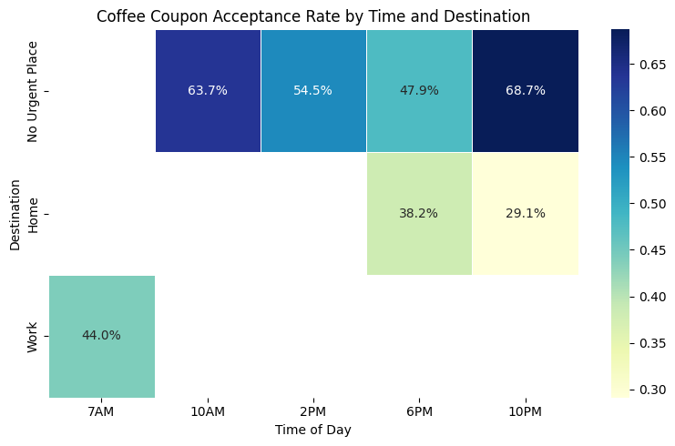
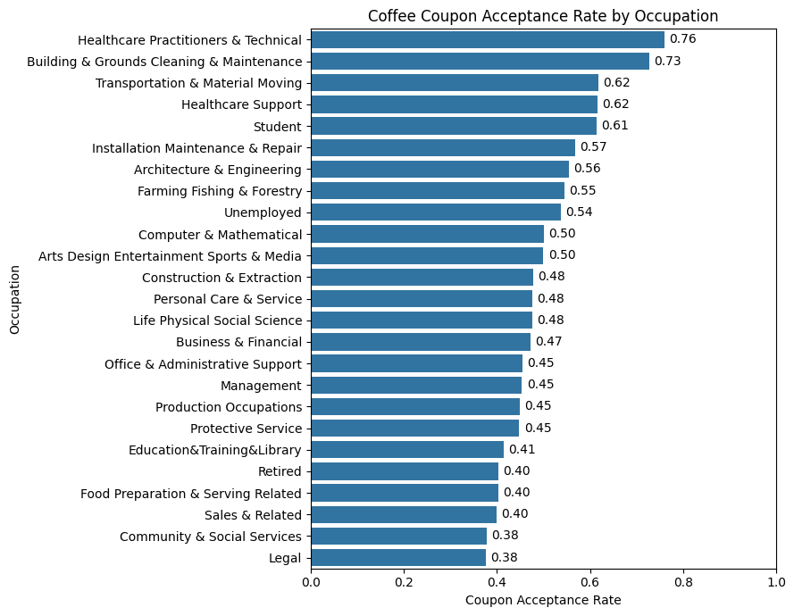
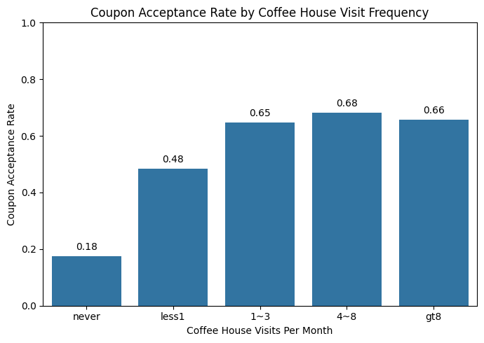

# Berkeley Assignment 5.1: Will the Customer Accept the Coupon?

Author: John Santa - johnjairo@gmail.com

## Problem

This project aims to identify key factors influencing a driver's decision to accept a mobile coupon for a nearby business (e.g., restaurant, bar, coffee house) under various driving conditions (passengers, weather, time).

Using a dataset from a UCI Machine Learning repository survey (collected via Amazon Mechanical Turk), the analysis will employ data visualization and probability distributions. The survey data captures driving scenarios and coupon acceptance (Y=1 for accept, Y=0 for reject) for five coupon types (restaurants <$20, coffee houses, carry-out, bars, and restaurants $20-$50).

The goal is to produce a brief report summarizing these differences, published on GitHub as a portfolio piece.

## Findings

### Data Cleaning & Overall Acceptance

*   The initial dataset underwent a cleaning process where several columns and rows were removed:
    *   The column `toCoupon_GEQ5min` was dropped as it provided no variance (all values were 1).
    *   The column `direction_opp` was dropped as it was a direct inverse of `direction_same`.
    *   Rows where the `car` type was 'do not drive' were excluded.
    *   Rows containing any missing values (`NaN`) in columns related to visit frequencies (`Bar`, `CoffeeHouse`, `CarryAway`, `RestaurantLessThan20`, `Restaurant20To50`) were removed.
*   After cleaning, 627 rows were dropped, resulting in a dataset of 12,057 observations.
*   Overall, approximately **56.95%** of customers chose to accept the coupons in the cleaned dataset.

### Bar Coupon Analysis

The analysis of bar coupon acceptance involved comparing different population segments:

| # | Segment of the Population                                                                              | Acceptance Rate |
|---|--------------------------------------------------------------------------------------------------------|-----------------|
| 1 | All Population *(baseline)*                                                                            | 56.95%          |
| 2 | Bar only *(q2)*                                                                                        | 41.13%          |
| 3 | >3 bar visits/month *(q3)*                                                                             | 75.92%          |
| 4 | >1 bar visit/month & age > 25y *(q4)*                                                                  | 76.34%          |
| 5 | >1 bar visit/month & age < 30y *(q6 bullet 2)*                                                         | 71.78%          |
| 6 | >1 bar visit/month & passenger != kids & not in farming/fishing/forestry jobs *(q5)*                   | 70.83%          |
| 7 | >1 bar visit/month & passenger != kids & not widowed *(q6 bullet 1)*                                   | 70.83%          |

**Conclusions from the table:**

1.  **Performance**: Bar coupons generally underperform by about 15% compared to the average acceptance rate of all coupons.
2.  **Bar Visit Frequency**: This is a strong indicator of acceptance. Targeting users with more than one bar visit per month significantly increases acceptance rates (an uplift of approximately 30% compared to the general bar coupon acceptance). The difference in acceptance between ">3 visits/month" and ">1 visit/month" is small, making ">1 visit/month" a good practical criterion.
3.  **Age**: Age has a limited impact. While drivers older than 25 show slightly higher acceptance than those younger than 30 (when combined with bar visit frequency), the difference is minor (~5%). Using "Age > 25y" is recommended as it covers a broader population segment.
4.  **Passengers**: The presence of kids as passengers had little impact on bar coupon acceptance in this analysis, likely due to a very small sample size (only 42 drivers with kids were presented with bar coupons). Therefore, passenger filters are not recommended.
5.  **Occupation & Marital Status (Widowed)**: These factors showed negligible effects on bar coupon acceptance and are not recommended as targeting criteria.

**Overall Recommendation**: To maximize the effectiveness of bar coupon campaigns, the data suggests targeting drivers who visit bars **more than once a month** and are **older than 25 years**.

## Independent Investigation

For the independent investigation request, I focused on the **Coffee House** coupons to explore factors influencing their acceptance. Based on my intuition, I decided to explore these variables:
- `time`: I suspect people drink more coffee in the morning vs. in the night
- `destination`: maybe people going to work, or at leisure, are more likely to want a coffee
- `occupation`: potentially certain occupations make it more likely to consume coffee
- `CoffeeHouse`: (this one count # of visits to coffee houses) directly relates to the probability of wanting a coffee

To assess the effectiveness of the selected columns, I created used some charts:

*
Chart 1: Heatmap of Coffee House Coupon Acceptance vs. Time and Destination.
*

*
Chart 2: Coffee House Coupon Acceptance by Top Occupations.
*

*
Chart 3: Coffee House Coupon Acceptance by Visit Frequency.
*

By choosing the top performing segments based on the columns above, I got to the following results:

| # | Segment of the Coffee Coupon Population                                          | Acceptance Rate |
|---|----------------------------------------------------------------------------------|-----------------|
| 1 | All Population *(baseline)*                                                      | 56.95%          |
| 2 | Coffee Coupons                                                                   | 49.72%          |
| 3 | No Urgent Place @10AM                                                            | 63.70%          |
| 4 | No Urgent Place @10PM                                                            | 68.70%          |
| 5 | Top 5 occupations                                                                | >60%            |
| 6 | >=1 visits/month to coffee houses                                                | >65%            |

**Conclusion**

I decided to combine the 3 segments above into a single one (an intersection of all the good performing criteria). These is the definition of the final segment criteria:
*   With a destination = `No Urgent Place`, driving at either `10AM` or `10PM`
*   In the top 5 occupations, based on coupon acceptance: 
    *   `Healthcare Practitioners & Technical`
    *   `Building & Grounds Cleaning & Maintenance`
    *   `Transportation & Material Moving`
    *   `Healthcare Support`
    *   `Student`
*   With `>=1 visits/month` to coffee houses

This combined segment achieves an `83%` coupon acceptance rate (high!). Nonetheless, the resulting combined segment only represents `2.6%` of the coffee coupons data sample, which may be on the smaller side if the total addressable market of drivers is limited. In case this is an issue that limits too much the business case, I recommend relaxing the restriction over `occupation` by including the top 10 instead of the top 5. 

By including the top 10 occupations instead of the top 5, we lose 3.4% of coupon acceptance, but go from 100 -> 241 drivers (more than doubled the segment size).

| Alternative                              | Acceptance Rate | Segment Size | Segment Size (% of coffee pop) |
|------------------------------------------|-----------------|--------------|--------------------------------|
| Use Top 5 occupations                    | 83.00%          | 100          | 2.6%                           |
| Use Top 10 occupations                   | 79.67%          | 241          | 6.3%                           |

Based on the above, my final recommendation is to use the Top 10 occupations, since the coupon acceptance rate is still very high, while the increase in opportunity surface area (and consequently the business value of the initiative) is significant.
